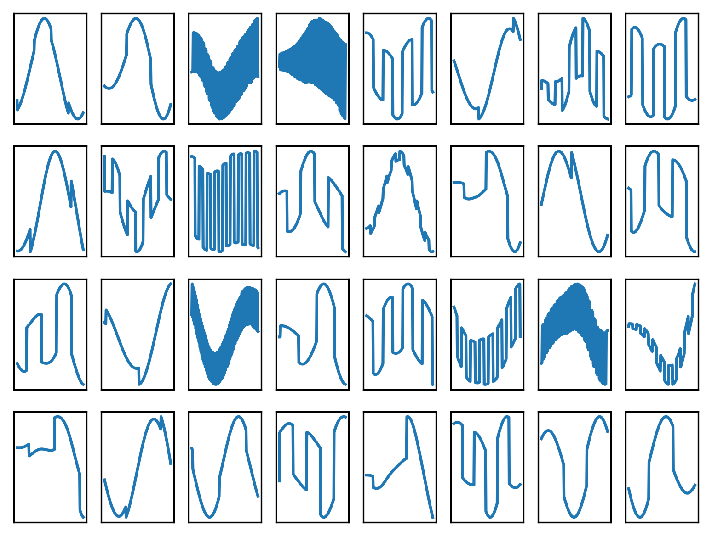
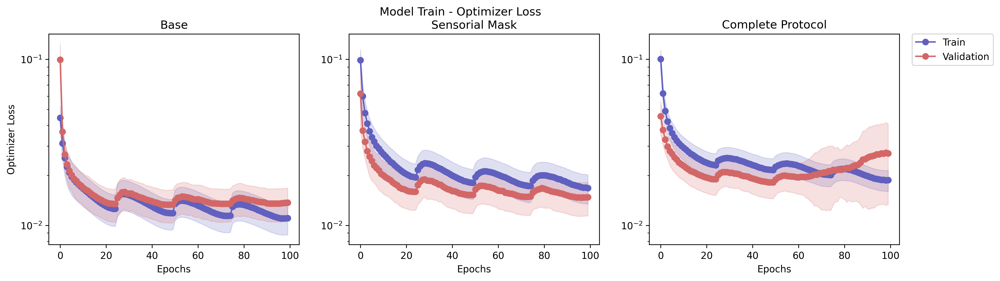

# World Machine - Toy1D - Experiment 0: Protocol Test

In this World Machine experiment, the goal is to make an initial check of whether the model is trainable, using the concept of state discovery, and what the potential impact of the training protocol is, observing the different tasks defined.

## Artifacts 

This are the artifacts versions related to this experiment.
If trying to re-run, please try using this artifacts (mainly the Docker container).

Also, observe that the experiment generated data is available.

- Code Version: [0.1](https://github.com/H-IAAC/WorldMachine/releases/tag/0.1)
- Docker Container Version: [eltoncn/world-machine:0.1
](https://hub.docker.com/repository/docker/eltoncn/world-machine/tags/0.1/sha256-f3645e07e3d5863d12f51955aad0b61c38ce6b3be4ec61aac16ea32ce4420f22)
- Experiments Results: [](https://doi.org/10.5281/zenodo.17352548)

## Concepts

This section briefly presents the newly introduced concepts necessary to understand this experiment. Since this is the first World Machine experiment, the new concepts introduced includes the concept of world model, and the model+protocol itself.

A deeper understanding can be obtained through the publications of this project.

### World Model, Computational World Model, State and Sensory Data.

A world model is the cognitive process that models the world in which the agent is inserted, and allows for predictions.

A computational world model is the computational system that makes predictions about the current and future state of a "world" based on the sensory data it receives, but inferring the internal structure of that world.

In this process, the "sensory data" is everything that the agent can observe of the external world, and the "state" is the internal model the agent creates to make sense and make predictions about this sensory data. The "state" of the world model does not correspond to the real state of the external world.

### World Machine

World Machine is a research project that explores the creation of computational world models.

It's also the proposed architecture and protocol of this project. The architecture is a transform-based model, that operates in "latent world states", vectors that encode the state of the world model at each instant. At each step, the model predicts the next latent world state using the previous one, conditioned on sensory data.

The core of the model consists of transform blocks. These can be of type "State" for blocks that process only the latent state without sensory data, "Sensory Data Channel Name" for blocks that use a sensory channel, and "State Input" for blocks that use the state itself at the beginning of the time step as sensory input.

### State Discovery

To ensure that the "latent world state" has its own encoding, as determined by the agent, these states are not provided in advance. However, they are necessary for model inference.

To solve this problem, the states are initially randomized. At each training step, the predicted states are saved and used for inference in the next step.

This process is called "state discovery".

### Protocol Steps

Several steps of a training protocol were developed for the World Machine training.

One of them, "sensory masking," involves masking sensory data during training, hiding a random amount of data at each step.

Understanding in depth how other steps of the protocol work is not necessary to understand this experiment

### Evaluation Tasks

To assess the capabilities of the World Machine, these tasks were established, to be carried out after training in the validation dataset:

- Normal: normal autoregressive model inference
- Use state: inference on previously encoded states, without sensory data.
- Prediction: inference of future states, using several previous encoded states, without sensory data.
- Prediction Shallow: inference of future states, using only one previous encoded state, without sensory data.
- Prediction Local: inference of next immediate state, using only one previous encoded state, without sensory data.
- MaskSensory@x: autoregressive model inference with x% sensory masking

### Toy1D Dataset

A synthetic dataset of one-dimensional time series. The series represent a damped physical system, $\vec{x}_{i+1} = F\vec{x}_i+\vec{u}_i$, where:

$$
F =  \begin{bmatrix} 
                1 & \Delta t & \frac{\Delta t^2}{2} \\
                -0.1 \Delta t & 1 & \Delta t \\
                0 & 0 & 1
            \end{bmatrix}
$$

$$\Delta t=1$$

The initial $x_0$ of each series is random, and $\vec{u}_i$ is a random square+impulse wave sum. The data is also clipped to avoid excessively high values Finally, it is also normalized.

The sensory data is the measurement $\vec{s}_i = \tanh(H \vec{x}_i)$, where H is an random 2x2 matrix.

In every use, only the position ($\vec{x}_i^0$) data is used. 

A sample of the dataset position data:



Since the dataset is stochastic, different data can be generated by controlling the seed of the random number generator.


## Experiment Definition

### Hypotheses and Goals

- H1: The proposed architecture is trainable, using the state discovery method and generating a model capable of coherently predicting sequences
- H2: The proposed protocol generates different models, with different performance in the designed tasks
- G1: To observe the tasks differences
- G2: To observe the quality of the model predictions

### Design

We train different model configurations. Each configuration may vary in the number of protocol steps used:

- Base: only state discovery.
- Sensory Mask: state discovery and sensory masking.
- Complete Protocol: all steps developed so far, state discovery, sensory masking, sequence breaker, state-check sensory, fast forward, short time recall, noise adding and local mode.

The training loss is the sensory loss sum of the MSE of the external state $\vec{x}_0^0$ (also called "state decoded") and MSE of the measurement $\vec{s}_i$.

The evaluation metrics are computed with a early saved model in the epoch of minimum validation optimizer loss. But, the training continue until the last epoch for the training metrics generation.

### Randomization

At each run, the dataset, model initial parameters and and random values ​​generated and used by each protocol step are randomized.

The randomization occurs with a given seed, that is equal for each run in each variation. So "Base-Run 0" uses the same random generator as "Sensory Mask". Since the values ​​depend on the order they are generated, we guarantee that at least the datasets generated for each run are the same between variations. 

### Sample size

For each variation, 15 models are trained in a dataset with 40000 sequences, with 60% for training and 20% for validation (+20% for test, not used).

### Manipulated variables

Training parameters:

- Batch size: 32
- Epochs: 100
- Optimizer: AdamW
- Learning rate: initial 1E-3
  - Cosine Annealing with Warmup scheduler
  - T0: 25
  - T_mult: 1
- Weight Decay: 1E-5

Common model parameters:

- State size: 128
- Positional encoder type: Alibi
- Attention heads: 4
- Block configuration: Measurement -> Measurement
- Sensory encoders and decoders: point-wise feedforwards

Protocol parameters (when used):

- State Discovery
  - Check input masks: True
  - Save state method: replace
- Sensory Masking
  - Uniform distribution masking rate between 0 and 1
- Sequence Breaker
  - N segment: 2
  - Fast Forward: True
- Short Time Recall
  - N (past and future): 5
  - Recall stride (past and future): 3
  - Channels: Measurement and external state
- Local Mode
  - Chance: 25%
- Noise Addition
  - State: $\sim\mathcal{N}(0, 0.1)$
  - Measurement: $\sim\mathcal{N}(0, 0.1)$

### Measured variables

For every model variation+run:

- Training losses
  - MSE and SDTW (Soft Dinamic Time Warping) of state decoded and measurement
  - Optimizer loss: sum of MSE of state decoded and measurement
  - Train and validation losses. But, some protocol steps are not executed in the validation dataset for faster training and better understanding of the model performance. 
- State decoded evaluation metrics
  - MSE and SDTW in defined tasks (normal, use state, prediction, prediction shallow, prediction local)
- Inference samples
  - In each task

### Analysis Plan

First, we compute the mean and standard deviation of each loss and metric.

The loss trend will be analyzed to verify that the model was adequately trained.

The metrics for each variation and task will be compared using mean and deviation to check for variations.

The samples will be analyzed qualitatively to check the coherence of the model's inferences.

## Ethical Considerations

Given the nature of this experiment, simulating a synthetic one-dimensional time series, it becomes difficult to understand what impacts this project might have. However, it is important to emphasize the need to analyze, discuss and mitigate potential risks during the development of this project in other experiments, and by analyzing its overall objectives.

## Experiment Execution

Inside the experiment Docker, or after installing both `world_machine` and `world_machine_experiments`, the experiment can be executed with:


```python
!python -m world_machine_experiments.toy1d.experiment0_protocol_test 
```

Please note that the experiment may take a few hours to run. The experiment results have been made available and will be presented below.

When running the experiment, we used an environment with:
- GPU: 1x NVIDIA A100 80GB PCIe
- RAM: 1.48 TB
- CPU: 2x Intel Xeon Platinum 8358 CPU @ 2.60GHz

But, it can possibly run on much less powerful hardware.

## Results

The experimental results are briefly presented in this section. Note that a more in-depth analysis can be found in the publications of this project.

### Train loss


- O1.1: The loss decreases while using the state discovery technique
- O1.2: The use of protocol techniques in training, but not in validation, causes an effect that tends to lead to a false conclusion of underfitting.
- O1.3: The complete protocol can cause divergence later in the training

### Evaluation Metrics

 

- O2.1: All models perform better in the normal task
- O2.2: The Base model cannot perform other tasks, which involve masking sensory data, adequately, since it was not trained in the absence of sensory data.
- O2.3: No model just guesses predictions in the absence of sensory data, since the metrics are always lower than in MaskSensory@100 (100% masking of sensory data $\to$ generates random sequence)
- O2.4: Shallow prediction is the most complex task to perform. No model can perform it well.
- O2.5: Using the full protocol results in worsening of the Normal and Use State tasks, but also results in significant improvements in Prediction Shallow and Prediction Local.
- O2.6: Using multiple pre-coded states (Use State) is considerably easier than using just one state (Local Prediction). The model may be using the trend of the states to predict the sequence.
- O2.7: SDTW captures more differences between the variations. But it also generates similar conclusions to the MSE.

### Inference Samples


- O3.1: The sequences that the model predicts are generally coherent, mainly without masking sensory data.
- O3.2: Complete protocol can better follow the signal format (e.g. seq 2 and 3), but still fails to predict future sequences correctly.
- O3.3: Base model fails to predict coherent sequences in the absence of sensory data
- O3.4: High frequency sequence (ex 4) may be more difficult to predict

## Conclusion

Linking the observations of the results to the stated hypotheses and objectives:

| Hyphotese/Goal                                                                                                                                 | Observations                             | Conclusion                                                                                                                                                                                  |
| ---------------------------------------------------------------------------------------------------------------------------------------------- | ---------------------------------------- | ------------------------------------------------------------------------------------------------------------------------------------------------------------------------------------------- |
| H1: The proposed architecture is trainable, using the state discovery method and generating a model capable of coherently predicting sequences | O1.1, O1.2, O1.3, O2.3, O3.1             | True. The model is trainable and is capable of coherent predict sequences.                                                                                                                  |
| H2: The proposed protocol generates different models, with different performance in the designed tasks                                         | O1.3, O2.2, O2.5, O3.2, O3.3             | True. The protocol steps generate differences in model training and predictions.                                                                                                            |
| G1: To observe the tasks differences                                                                                                           | O2.1, O2.4, O2.5, O2.6, O3.1, O3.2, O3.4 | Tasks have different performance, both objectively and qualitatively, with some being more difficult than others. Sometimes, an improvement in one task can lead to a worsening in another. |
| G2: To observe the quality of the model predictions                                                                                            | O3.1, O3.2, O3.3, O3.4                   | The model manages to generate coherent predictions, but still fails in several cases.                                                                                                       |
